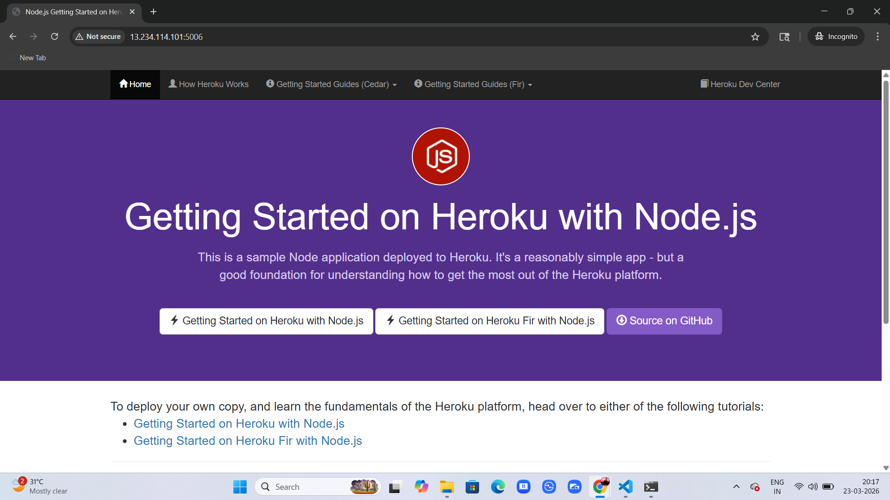

## 🚀 Manual Deployment of Web Application on AWS EC2

This project demonstrates how to manually deploy a web application on an AWS EC2 instance without using automation tools. It provides a deep understanding of how real-world deployments work behind the scenes.

---

## 🎯 Objective

* Deploy a web application on AWS EC2
* Configure server environment manually
* Set up NGINX as a reverse proxy
* Expose application securely to the internet

---

## 🛠️ Tech Stack

| Category        | Technology     |
| --------------- | -------------- |
| Cloud           | AWS EC2        |
| Web Server      | NGINX          |
| Runtime         | Node.js        |
| Version Control | Git            |
| OS              | Linux (Ubuntu) |

---

## ⚙️ Architecture

```
User → Browser → NGINX (Port 80) → Node.js App (Port 3000) → EC2 Instance
```

---

## 🚀 Deployment Steps

### 1️⃣ Launch EC2 Instance

* Create EC2 instance
* Configure key pair
* Enable ports: 22, 80, 443

---

### 2️⃣ Connect via SSH

```bash
ssh -i key.pem ubuntu@<public-ip>
```

---

### 3️⃣ Install Dependencies

```bash
sudo apt update
sudo apt install nginx git -y
sudo apt install nodejs -y
```

---

### 4️⃣ Clone & Run Application

```bash
git clone <your-repo-url>
cd <project-folder>
npm install
npm start
```

---

### 5️⃣ Configure NGINX

Edit config file:

```bash
sudo nano /etc/nginx/nginx.conf
```

Add:

```nginx
server {
    listen 80;
    server_name _;

    location / {
        proxy_pass http://localhost:3000;
        proxy_http_version 1.1;
        proxy_set_header Upgrade $http_upgrade;
        proxy_set_header Connection 'upgrade';
        proxy_set_header Host $host;
    }
}
```

Restart NGINX:

```bash
sudo systemctl restart nginx
```

---

### 6️⃣ Access Application 🌐

* Open browser
* Visit: `http://<your-ec2-public-ip>`

---

## 📸 Screenshots

### 🔹 EC2 Instance Running


### 🔹 Application in Browser



### 🔹 NGINX Configuration


> 📁 Create a `screenshots/` folder in your repo and add your images there.

---

## 🔐 Security Configuration

* SSH → Port 22
* HTTP → Port 80
* HTTPS → Port 443 (optional)
* Restricted access using Security Groups

---

## 🧠 Key Learnings

* Manual cloud deployment
* Linux server management
* Reverse proxy setup
* Networking & security basics
* Understanding CI/CD foundations

---

## 📈 Future Improvements

* Add HTTPS using SSL (Let's Encrypt)
* Automate using Jenkins / GitHub Actions
* Containerize using Docker
* Deploy using Kubernetes

---

## 🤝 Contributing

Feel free to fork this repo and improve it!

---

## 📄 License

This project is licensed under the MIT License.

---

⭐ If you found this helpful, give it a star!
